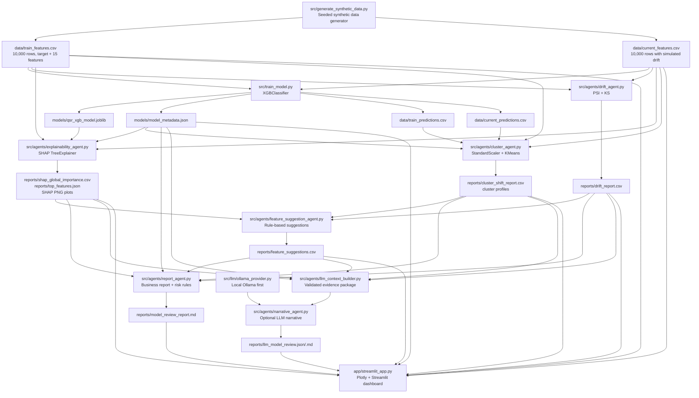

# PurchaseIntel Lens Codebase Graph

## Runtime Architecture



## Integration Order

```bash
python src/generate_synthetic_data.py
python src/train_model.py
python src/agents/drift_agent.py
python src/agents/explainability_agent.py
python src/agents/cluster_agent.py
python src/agents/feature_suggestion_agent.py
python src/agents/report_agent.py
python src/agents/llm_context_builder.py
# Optional AI narrative after Ollama is running:
python src/agents/narrative_agent.py
python src/validate_integration.py
streamlit run app/streamlit_app.py
```

## Artifact Contracts

| Producer | Consumer | Contract |
| --- | --- | --- |
| Synthetic generator | Trainer, drift, SHAP, clustering, dashboard | `user_id`, 15 numeric model features, `purchase_qsr_next_30d` |
| Trainer | SHAP, clustering, report, dashboard | XGBoost model, feature order, metrics, user probabilities |
| Drift agent | Suggestions, report, dashboard | One row per trained feature with PSI, KS, mean shift, drift severity |
| Explainability agent | Suggestions, report, dashboard | One row per feature ranked by mean absolute SHAP value plus plot files |
| Cluster agent | Suggestions, report, dashboard | Named cluster shares, shifts, profiles, and optional prediction means |
| Feature suggestion agent | Report, dashboard | Proposed feature, reason, linked evidence, priority |
| Report agent | Dashboard | Markdown review with performance, monitoring, recommendations, and risk |
| LLM context builder | Narrative agent | Compact evidence payload containing validated metrics and findings only |
| Narrative agent | Dashboard | Optional structured LLM narrative with provider/model provenance |

## LLM Usage

The core analytics and risk decision remain deterministic. An optional local
LLM narrative layer can now summarize the verified outputs for the demo.

| Component | Technique Used |
| --- | --- |
| Prediction model | `XGBClassifier` |
| Explainability | SHAP `TreeExplainer` |
| Drift checks | PSI and Kolmogorov-Smirnov tests |
| Segmentation | `StandardScaler` and `KMeans` |
| Feature suggestions | Fixed Python rules over saved reports |
| Model review report | Deterministic Markdown template over saved reports |
| AI narrative review | Optional Ollama model over validated evidence only |
| Dashboard | Streamlit and Plotly rendering |

`reports/model_review_report.md` remains the source-of-truth deterministic
report. When generated, `reports/llm_model_review.md` is explicitly labeled
as AI interpretation and records the provider and model used.

## Verification

Run:

```bash
python src/validate_integration.py
```

The validator checks that feature, prediction, model metadata, monitoring,
recommendation, and final report artifacts exist and agree on the shared
feature and population contracts.
