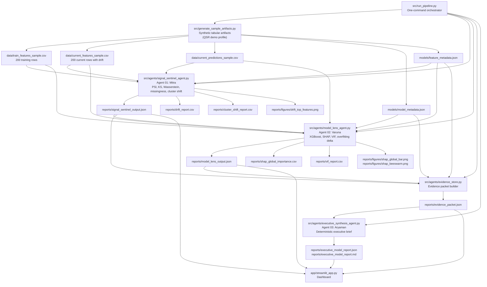

# VyaAI Codebase Graph

## Runtime Architecture



## Integration Order

```bash
python src/run_vyaai_pipeline.py
streamlit run app/streamlit_app.py
```

## Artifact Contracts

| Producer | Consumer | Contract |
| --- | --- | --- |
| Sample generator or external artifact drop | Mitra, Varuna | Train/current feature tables, labels when available, current predictions, model metadata, feature metadata |
| Model metadata | Mitra, Varuna, Evidence Store | `target`, `entity_id`, `prediction_column`, `feature_columns`, performance metrics, business use case |
| Agent 01: Mitra | Evidence Store, Varuna, Dashboard | Feature drift, prediction summary, missingness, cluster share movement |
| Agent 02: Varuna | Evidence Store, Dashboard | SHAP importance, VIF report, overfitting delta, high-risk feature matrix |
| Evidence Store | Agent 03: Aryaman | Single evidence packet containing deterministic outputs only |
| Agent 03: Aryaman | Dashboard, stakeholders | Consulting-style JSON and Markdown model health brief |

## Verification

```bash
python -m unittest discover -s tests
python -m compileall -q src app tests
```
