# AxionAI Codebase Graph

## Architecture Level

AxionAI is a **file-backed, deterministic multi-agent workflow** for model intelligence.

The current MVP does **not** use LangGraph, CrewAI, AutoGen, or an external agent runtime. The multi-agent framework is intentionally lightweight:

- `src/run_axionai_pipeline.py` is the orchestrator.
- Each agent is a Python class with a clear input/output contract.
- Agents communicate through saved artifacts in `data/`, `models/`, and `reports/`.
- Deterministic Python code calculates metrics.
- `src/utils/artifact_validation.py` validates schema contracts before agent execution.
- `src/utils/run_archive.py` snapshots each successful run under `reports/runs/<run_id>/`.
- The optional LLM layer is prepared only for narrative synthesis and must use verified evidence.

This is the right level for the current demo because it keeps execution simple, local, auditable, and easy to explain.

## Runtime Graph

```mermaid
flowchart TD
    subgraph Inputs["Input Artifacts"]
        G["src/generate_sample_artifacts.py<br/>Synthetic sample artifact generator"]
        TF["data/train_features_sample.csv<br/>Training feature table"]
        CF["data/current_features_sample.csv<br/>Current feature table"]
        PR["data/current_predictions_sample.csv<br/>Current model outputs"]
        TRP["data/train_predictions_sample.csv<br/>Optional reference model outputs"]
        MM["models/model_metadata.json<br/>Target, entity, prediction, features, metrics"]
        FM["models/feature_metadata.json<br/>Feature definitions"]
    end

    subgraph Orchestration["Workflow Orchestration"]
        P["src/run_axionai_pipeline.py<br/>Sequential deterministic orchestrator"]
        VAL["src/utils/artifact_validation.py<br/>Input contract validation"]
        AR["src/utils/run_archive.py<br/>Timestamped run archive"]
    end

    subgraph Agents["Five-Agent Model Intelligence Workflow"]
        M["Agent 01: Mitra<br/>src/agents/signal_sentinel_agent.py<br/>Drift, missingness, prediction summary, cluster shift"]
        V["Agent 02: Varuna<br/>src/agents/model_lens_agent.py<br/>SHAP, VIF, reviewer model, overfitting delta"]
        A["Agent 03: Aryaman<br/>src/agents/executive_synthesis_agent.py<br/>Executive model health brief"]
        S["Agent 04: Samanvaya<br/>src/agents/samanvaya_calibration_agent.py<br/>Governed feedback calibration recommendations"]
        W["Agent 05: Vishwakarma<br/>src/agents/vishwakarma_visual_architect.py<br/>Risk visuals and lineage SVG"]
    end

    subgraph Evidence["Evidence Layer"]
        ES["src/agents/evidence_store.py<br/>Evidence packet builder"]
        EP["reports/evidence_packet.json<br/>Single verified evidence package"]
    end

    subgraph Reports["Generated Outputs"]
        SO["reports/mitra_output.json"]
        DQ["reports/data_quality_report.csv"]
        PD["reports/prediction_drift_report.json"]
        DR["reports/drift_report.csv"]
        CR["reports/cluster_shift_report.csv"]
        DF["reports/figures/drift_top_features.png"]
        LO["reports/varuna_output.json"]
        SH["reports/shap_global_importance.csv"]
        VF["reports/vif_report.csv"]
        SF["reports/figures/shap_bar.png<br/>reports/figures/shap_beeswarm.png"]
        XO["reports/aryaman_output.json<br/>reports/executive_model_report.json<br/>reports/executive_model_report.md"]
        SA["reports/samanvaya_output.json<br/>reports/calibration_recommendations.json<br/>reports/config_change_log.json<br/>configs/calibration_config_v2_recommended.json"]
        WV["reports/visuals/<br/>Interactive plots, graph JSON, lineage SVG, visual manifest"]
    end

    subgraph Presentation["Presentation"]
        UI["app/streamlit_app.py<br/>Streamlit dashboard"]
        FB["src/memory/feedback_store.py<br/>Governed feedback log"]
        RA["docs/assets/*.png<br/>README visual proof assets"]
        RS["scripts/render_readme_assets.py<br/>README asset renderer"]
    end

    P --> G
    P --> VAL
    G --> TF
    G --> CF
    G --> PR
    G --> TRP
    G --> MM
    G --> FM
    TF --> VAL
    CF --> VAL
    PR --> VAL
    MM --> VAL
    FM --> VAL

    P --> M
    VAL --> M
    TF --> M
    CF --> M
    PR --> M
    TRP --> M
    MM --> M
    FM --> M
    M --> SO
    M --> DQ
    M --> PD
    M --> DR
    M --> CR
    M --> DF

    P --> V
    TF --> V
    CF --> V
    PR --> V
    MM --> V
    FM --> V
    SO --> V
    SO -->|"Reliability gate<br/>severe PSI or KS"| V
    V --> LO
    V --> SH
    V --> VF
    V --> SF

    P --> ES
    SO --> ES
    LO --> ES
    MM --> ES
    FM --> ES
    ES --> EP
    EP --> W
    W --> WV
    WV --> ES

    P --> A
    EP --> A
    A --> XO
    P --> S
    UI --> FB
    FB --> S
    S --> SA

    SO --> UI
    LO --> UI
    EP --> UI
    XO --> UI
    DF --> UI
    SF --> UI
    WV --> UI

    SO --> RS
    LO --> RS
    XO --> RS
    DR --> RS
    SF --> RS
    RS --> RA
    P --> AR
    SO --> AR
    LO --> AR
    EP --> AR
    XO --> AR
```



## Agent Responsibilities

| Agent | File | Responsibility | Main Outputs |
| --- | --- | --- | --- |
| Agent 01: Mitra | `src/agents/signal_sentinel_agent.py` | Detect signal drift, prediction score drift, missing-value shifts, data-quality failures, and cluster/context movement. | `mitra_output.json`, `data_quality_report.csv`, `prediction_drift_report.json`, `drift_report.csv`, `cluster_shift_report.csv`, `drift_top_features.png` |
| Agent 02: Varuna | `src/agents/model_lens_agent.py` | Explain model behavior and identify feature-level model risks using SHAP, VIF, and train-validation metric delta. Flags SHAP reliability when Mitra finds severe drift. | `varuna_output.json`, `shap_global_importance.csv`, `vif_report.csv`, SHAP plots |
| Agent 03: Aryaman | `src/agents/executive_synthesis_agent.py` | Convert only the verified evidence packet into a concise executive model health brief. | `aryaman_output.json`, `executive_model_report.json`, `executive_model_report.md` |
| Agent 04: Samanvaya | `src/agents/samanvaya_calibration_agent.py` | Read governed dashboard feedback and propose config changes for human review without mutating runtime behavior. | `samanvaya_output.json`, `calibration_recommendations.json`, `config_change_log.json`, `calibration_config_v2_recommended.json` |
| Agent 05: Vishwakarma | `src/agents/vishwakarma_visual_architect.py` | Convert verified outputs into report-ready visuals and a run-specific lineage map without mutating monitoring metrics. | `reports/visuals/*.json`, `reports/visuals/*.html`, `lineage_graph.svg`, `vishwakarma_output.json` |

## Workflow Framework

The multi-agent workflow uses a **custom deterministic Python orchestration pattern**, not a third-party agent framework.

```text
run_axionai_pipeline.py
  -> Generate sample artifacts, or skip with --use-existing-artifacts
  -> Validate artifact contract
  -> Run Agent 01: Mitra
  -> Run Agent 02: Varuna with Mitra drift reliability gate
  -> Build evidence packet
  -> Run Agent 05: Vishwakarma visual architect
  -> Refresh evidence packet with same-run visual manifest paths
  -> Run Agent 03: Aryaman
  -> Run Agent 04: Samanvaya
  -> Archive timestamped run
```

Why this design:

- Easier to audit than conversational agent handoffs
- No hidden tool calls or implicit state
- Every intermediate output is saved to disk
- Pipeline failures write a meaningful `reports/pipeline_error.json` instead of only a traceback
- Works locally without API keys
- Keeps the LLM out of metric calculation
- Varuna defaults to `VARUNA_DRIFT_GATE_MODE=flag`; set `VARUNA_DRIFT_GATE_MODE=skip` to skip SHAP under severe drift
- Simple to replace later with LangGraph, CrewAI, Prefect, Dagster, or Airflow if orchestration complexity grows

## Artifact Contracts

| Producer | Consumer | Contract |
| --- | --- | --- |
| Sample generator or external artifact drop | Mitra, Varuna | Train/current feature tables, labels when available, current predictions, model metadata, feature metadata |
| Artifact validator | Orchestrator, agents | Fails fast on missing metadata fields, CSV read failures, and schema mismatches |
| Model metadata | Mitra, Varuna, Evidence Store | `target`, `entity_id`, `prediction_column`, `feature_columns`, performance metrics, business use case |
| Agent 01: Mitra | Evidence Store, Varuna, Dashboard | Feature drift, prediction summary, missingness, cluster share movement |
| Agent 01: Mitra | Agent 02: Varuna | Drift severity gate that marks SHAP output unreliable when PSI or KS thresholds are severe |
| Agent 02: Varuna | Evidence Store, Dashboard | SHAP importance, VIF report, train-validation metric delta, high-risk feature matrix, explainability reliability status |
| Evidence Store | Agent 03: Aryaman | Single evidence packet containing deterministic outputs only |
| Evidence Store | Agent 05: Vishwakarma | Verified monitoring outputs and model context for deterministic visualization |
| Agent 05: Vishwakarma | Evidence Store, Dashboard, Agent 03: Aryaman | Same-run visual manifest, interactive plots, and lineage SVG |
| Agent 03: Aryaman | Dashboard, stakeholders | Consulting-style JSON and Markdown model health brief |
| Dashboard feedback | Agent 04: Samanvaya | `reports/feedback_log.csv` structured analyst, executive, and client-safe feedback events |
| Agent 04: Samanvaya | Human reviewer | Pending-only config proposal and change log; active v1 thresholds remain unchanged |
| README asset renderer | GitHub README | PNG visual proof from generated reports |

## Current Gaps And Next Layer

The current MVP now has the first hooks for production behavior: schema validation, graceful failure messages, SHAP reliability gating, timestamped local run archives, and dashboard feedback capture.

The next major architectural layer should be an **Organizational Intelligence Layer**:

- Team-specific calibration thresholds
- Known data pipeline topology
- Historical false-positive and false-negative feedback
- Report usage signals
- Per-stakeholder output preferences
- Multi-run comparisons across archived evidence packets

## Execution Commands

```bash
python src/run_axionai_pipeline.py
python src/run_axionai_pipeline.py --use-existing-artifacts
python scripts/render_readme_assets.py
streamlit run app/streamlit_app.py
```

## Verification

```bash
python -m unittest discover -s tests
python -m compileall -q src app tests scripts
```
