# AxionAI

**Data science model intelligence for drift, explainability, calibration, lift, and auditable ML review.**

AxionAI is a portfolio-grade local MVP that reviews existing tabular model artifacts and converts them into deterministic diagnostics, visual evidence, stakeholder-ready reporting, and governed feedback recommendations.

It is built for the work data scientists actually do after a model is trained: verify current-period behavior, explain what changed, identify weak cohorts, package evidence, and communicate model health without letting an LLM invent metrics.

> **Scope:** Synthetic data only. AxionAI is a local model-intelligence demo, not a production validation platform or formal model-risk approval system.

---

## Why AxionAI Exists

Predictive models often degrade quietly. Feature distributions shift, important drivers become unstable, prediction scores move, calibration weakens, and global metrics hide cohort-level failure.

In many teams, these checks live across notebooks, dashboards, one-off scripts, screenshots, and slide decks. That creates three problems:

- Data scientists spend too much time stitching diagnostics together.
- Business stakeholders receive summaries that are hard to trace back to evidence.
- Feedback does not become a governed improvement loop.

**AxionAI helps move model review from disconnected diagnostics to auditable, business-ready model intelligence.**

---

## What It Does

AxionAI takes standard model-review artifacts:

- feature tables
- prediction files
- labels when available
- model metadata
- feature metadata
- calibration configuration

Then it runs deterministic Python agents to produce:

- data-quality checks
- feature drift and prediction drift
- SHAP explainability
- VIF multicollinearity diagnostics
- calibration and Brier score checks
- lift and score-decile analysis
- segment/cohort performance review
- visual lineage and risk charts
- executive model-health reports
- human-reviewable threshold recommendations

All outputs are saved as auditable artifacts: `JSON`, `CSV`, `Markdown`, `PNG`, `SVG`, and `HTML`.

---

## Architecture

```mermaid
flowchart LR
    A["Input Artifacts<br/>features, predictions, labels, metadata"] --> B["Contract Validation"]
    B --> C["Agent 01: Mitra<br/>Signal Monitoring"]
    C --> D["Agent 02: Varuna<br/>Model Diagnostics"]
    D --> E["Evidence Store<br/>Verified JSON Packet"]
    E --> F["Agent 05: Vishwakarma<br/>Visual Intelligence"]
    F --> G["Evidence Refresh<br/>Same-Run Visuals"]
    G --> H["Agent 03: Aryaman<br/>Executive Synthesis"]
    H --> I["Streamlit Dashboard<br/>Stakeholder Review"]
    I --> J["Agent 04: Samanvaya<br/>Feedback Calibration"]
    J --> K["Config Recommendation<br/>Human Approval Required"]
```



AxionAI intentionally uses a lightweight Python orchestrator instead of LangGraph, CrewAI, or AutoGen. The current workflow is linear, local, deterministic, and artifact-backed. That keeps the system easy to audit, demo, and extend.


For the deeper file-level graph, see [CODEBASE_GRAPH.md](CODEBASE_GRAPH.md).

---

## Five-Agent Workflow

| Agent | Role | Data science value | Key outputs |
| --- | --- | --- | --- |
| **Mitra** | Signal monitoring | Detects data quality issues, feature drift, prediction drift, and cluster/context movement. | `mitra_output.json`, `drift_report.csv`, `prediction_drift_report.json`, `cluster_shift_report.csv` |
| **Varuna** | Model diagnostics | Explains behavior and evaluates model quality with SHAP, VIF, calibration, lift, score deciles, and segment diagnostics. | `varuna_output.json`, `shap_global_importance.csv`, `vif_report.csv`, `calibration_report.csv`, `lift_report.csv`, `segment_performance_report.csv` |
| **Aryaman** | Executive synthesis | Converts verified evidence into a concise model-health brief for business and data science leaders. | `executive_model_report.md`, `executive_model_report.json`, `aryaman_output.json` |
| **Samanvaya** | Feedback calibration | Reads structured feedback and proposes threshold/config changes for human approval. | `samanvaya_output.json`, `calibration_recommendations.json`, `calibration_config_v2_recommended.json` |
| **Vishwakarma** | Visual intelligence | Generates risk visuals and a run-specific lineage map without mutating metrics. | `feature_risk_scatter.html`, `prediction_distribution_overlay.html`, `lineage_graph.svg` |

---

## Data Science Diagnostics

### Monitoring

- Population Stability Index, or PSI
- Kolmogorov-Smirnov test
- Wasserstein distance
- missing-rate movement
- boundary checks
- cardinality checks
- prediction score drift
- cluster/context shift

### Model Quality

- SHAP global importance
- feature-risk matrix
- VIF multicollinearity
- train-validation AUC delta
- calibration bins
- Brier score
- expected calibration error
- lift and cumulative gain
- score-decile review
- segment-level calibration and lift

### Governance

- deterministic metrics only
- schema-aware artifact validation
- evidence packet before reporting
- config-driven thresholds
- feedback saved as structured events
- proposed config changes require human approval
- optional LLM boundary is narrative-only

---

## Dashboard Preview

The dashboard is built with Streamlit and consumes saved artifacts from `data/`, `models/`, `reports/`, and `configs/`.

### Model Health Summary


### Drift Report


### SHAP Feature Importance


### High-Risk Feature Matrix


### Executive Report


### Governed Feedback Calibration


---

## Sample Synthetic Demo Result

The bundled demo uses a synthetic QSR purchase-propensity profile. The same artifact contract can be adapted to fraud, risk, credit, retention, churn, or marketing-response models.

| Evidence | Example result |
| --- | --- |
| Executive model health | `High Risk` |
| High-drift features | `merchant_novelty_rate`, `weekend_dining_frequency` |
| Prediction drift | `High`; score mean moved by approximately `-9.0%` |
| Calibration diagnostics | Brier score and expected calibration error generated from current-window labels |
| Lift diagnostics | Top score-decile lift generated for audience quality review |
| Segment diagnostics | Segment-level score, outcome, lift, Brier score, and calibration-gap review |
| Feature-risk matrix | Important SHAP drivers combined with drift and VIF evidence |
| Feedback governance | Pending recommendations require human approval |

---

## Generated Artifacts

```text
reports/
  mitra_output.json
  drift_report.csv
  prediction_drift_report.json
  cluster_shift_report.csv
  varuna_output.json
  shap_global_importance.csv
  vif_report.csv
  score_decile_report.csv
  calibration_report.csv
  lift_report.csv
  segment_performance_report.csv
  feature_risk_matrix.csv
  evidence_packet.json
  executive_model_report.md
  executive_model_report.json
  samanvaya_output.json
  calibration_recommendations.json
  config_change_log.json
  figures/
    drift_top_features.png
    shap_bar.png
    shap_beeswarm.png
    calibration_curve.png
    lift_chart.png
    segment_performance_heatmap.png
  visuals/
    feature_risk_scatter.html
    prediction_distribution_overlay.html
    lineage_graph.svg
```

See [docs/sample_outputs.md](docs/sample_outputs.md) for an artifact-by-artifact guide.

---

## Run Locally

Install dependencies:

```bash
pip install -r requirements.txt
```

Run the full pipeline:

```bash
python src/run_axionai_pipeline.py
```

Launch the dashboard:

```bash
streamlit run app/streamlit_app.py
```

Run validation:

```bash
pytest tests/
python -m unittest discover -s tests
python -m compileall -q src app tests scripts
```

Useful optional commands:

```bash
python src/run_axionai_pipeline.py --use-existing-artifacts
python scripts/render_readme_assets.py
```

For a screen-by-screen walkthrough, see [docs/demo_walkthrough.md](docs/demo_walkthrough.md).

---

## Repository Map

```text
src/agents/       Deterministic model-intelligence agents
src/diagnostics/  SHAP, VIF, calibration, lift, segment, and model-quality utilities
src/graph/        Lineage graph builder and SVG renderer
src/memory/       Structured feedback storage
src/reports/      Markdown report rendering helpers
src/utils/        Artifact validation and run archive utilities
app/              Streamlit dashboard
configs/          Versioned calibration thresholds and recommendations
data/             Synthetic sample feature and prediction artifacts
models/           Synthetic model and feature metadata
reports/          Generated evidence, diagnostics, reports, and visuals
docs/             Architecture notes, demo walkthrough, and positioning docs
```

---

## Current Validation

- `44` pytest tests passed
- `11` unittest checks passed
- Streamlit smoke test passed
- Python compile check passed

---

## Target Use Cases

### Purchase Intelligence

- propensity model monitoring
- audience quality review
- merchant/category behavior shifts
- campaign activation readiness

### Fraud And Risk

- fraud-score distribution monitoring
- feature stability review
- threshold and calibration review
- governance-ready evidence packaging

### Model Governance

- model-health review before activation
- auditable diagnostics and evidence packets
- stakeholder-ready reporting
- human-approved calibration recommendations

---

## What Makes It Data Science Friendly

- Works from common artifacts instead of a vendor-specific SDK.
- Keeps metrics deterministic and reproducible.
- Separates monitoring, model diagnostics, reporting, feedback, and visualization.
- Produces CSVs that can be reopened in notebooks.
- Produces JSON packets that can feed reporting, governance, or future LLM layers.
- Makes weak cohorts visible instead of relying only on global metrics.
- Avoids framework lock-in while preserving clear agent boundaries.

For interview and portfolio framing, see [docs/data_science_positioning.md](docs/data_science_positioning.md).

---

## Roadmap

Near-term extensions that would make AxionAI stronger for real data science teams:

- historical run comparison across archived evidence packets
- richer schema validation for arbitrary external artifacts
- adversarial validation for multivariate drift
- bootstrap confidence intervals for lift and segment diagnostics
- model registry connectors such as MLflow
- warehouse/object-store connectors such as Snowflake, Databricks, S3, or DuckDB
- optional local LLM narrative generation from the evidence packet only

---

## Disclaimer

This repository uses synthetic data only. It does not use real customer, financial, transaction, or consumer data. It is not affiliated with Affinity Solutions, Comet, or any financial institution.

AxionAI should not be treated as production model validation, regulatory approval, or a substitute for formal model-risk governance.
