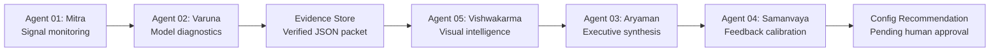
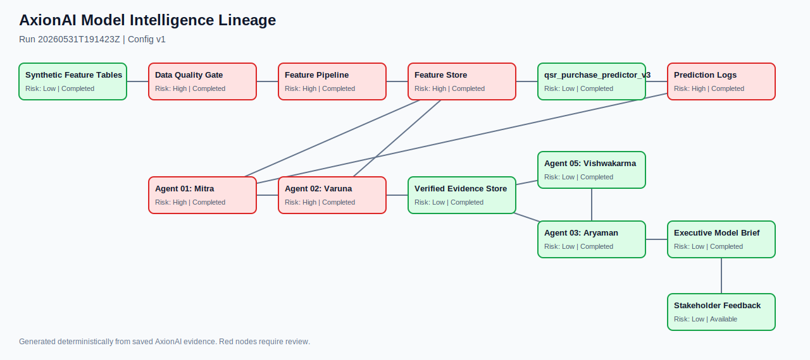
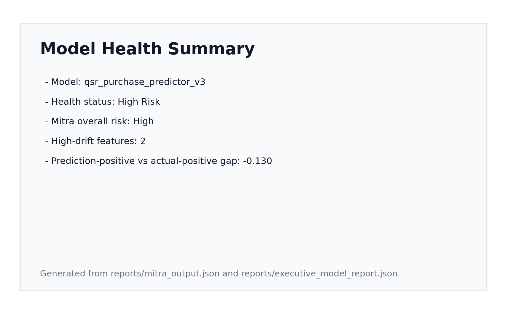
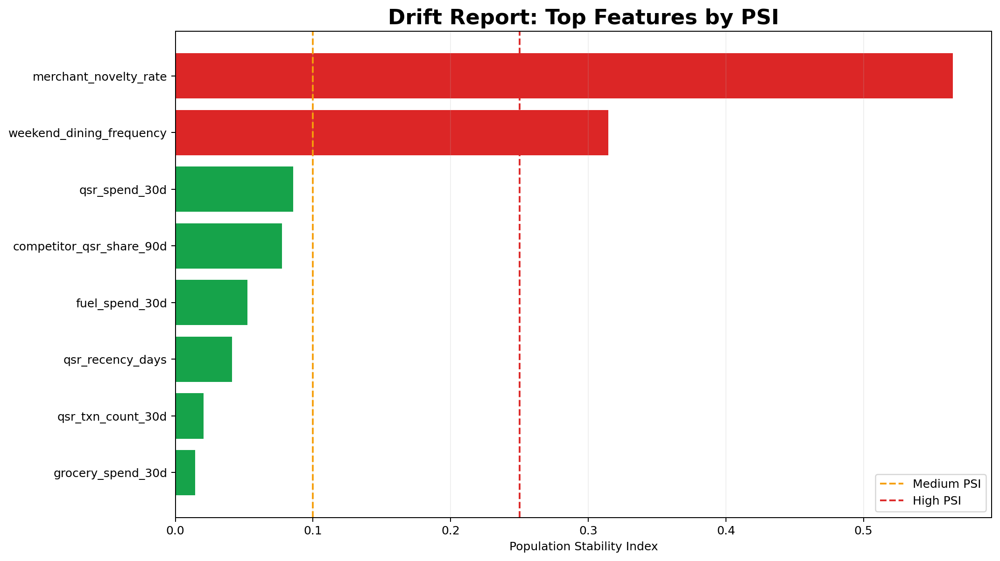
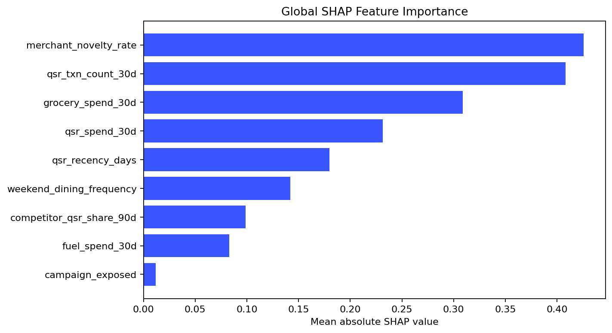
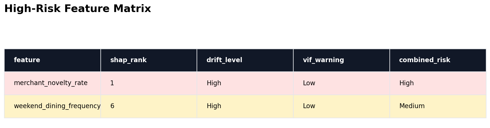
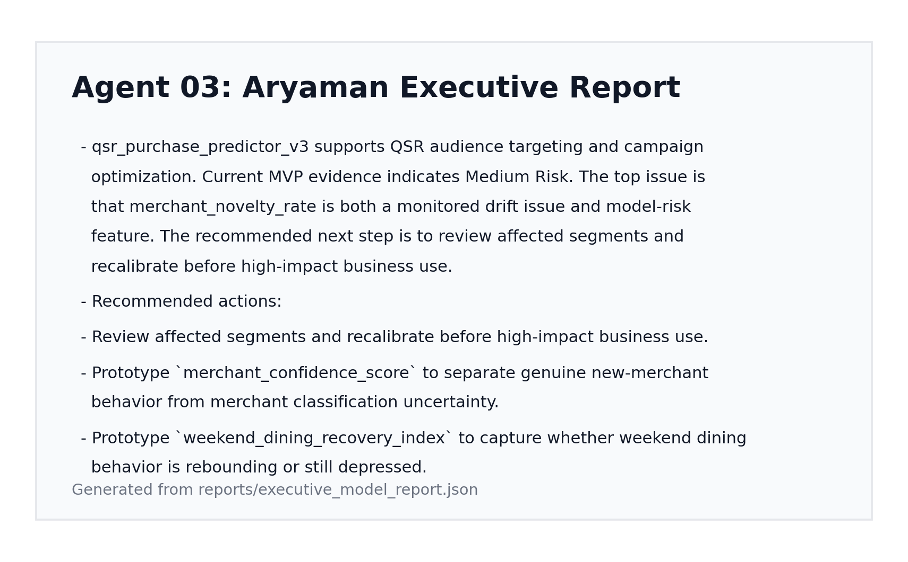
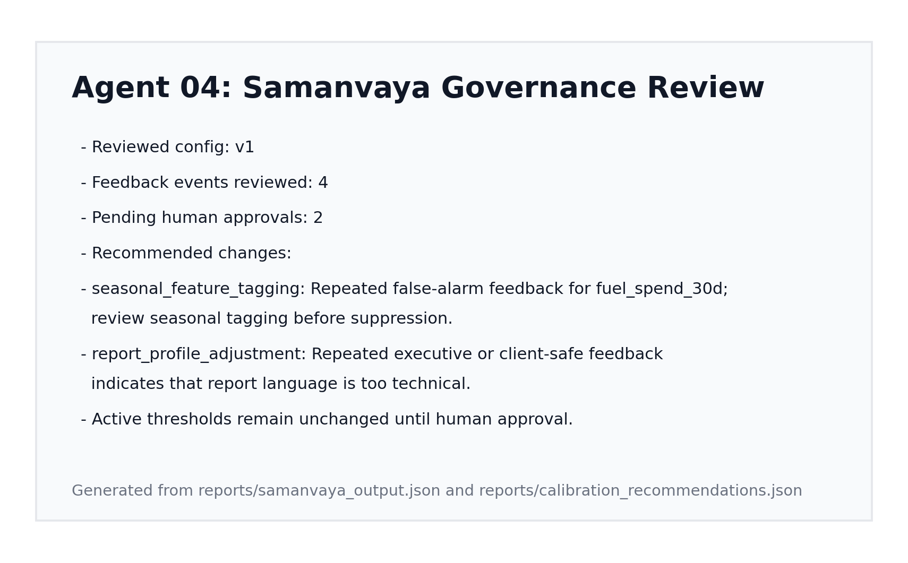

# AxionAI

**Agentic model intelligence for auditable, business-ready ML review.**

AxionAI is a portfolio-grade local MVP that turns model artifacts into deterministic diagnostics, visual evidence, an executive model-health brief, and human-reviewable calibration recommendations.

> **Scope:** This repository uses synthetic data only. It is a local demonstration of model-intelligence architecture, not a production validation platform.

## Problem

ML teams often review drift, explainability, model quality, and stakeholder feedback in disconnected tools. That makes it difficult to answer basic operational questions:

- Which signals changed?
- Do changed features matter to the model?
- Can business stakeholders understand the impact?
- Which recommendations trace back to verified evidence?
- Can feedback improve future reviews without silently changing runtime behavior?

## Why This Matters

**AxionAI helps ML teams move from disconnected diagnostics to auditable, business-ready model intelligence.**

The MVP combines model monitoring, explainability, visual reporting, executive synthesis, and governed feedback calibration in one local workflow. Metrics remain deterministic and reviewable; stakeholder communication is built from saved evidence.

## Five-Agent Architecture



The full workflow includes input validation, a same-run evidence refresh after visual generation, and timestamped run archives:

```text
Synthetic or external artifact drop
  -> Validate metadata and feature-table contracts
  -> Mitra: data quality, drift, prediction movement, cluster shift
  -> Varuna: SHAP, VIF, overfitting delta, feature-risk matrix
  -> Evidence Store: verified machine-readable packet
  -> Vishwakarma: report visuals and lineage SVG
  -> Evidence Store refresh: attach matching-run visual manifest
  -> Aryaman: concise evidence-based executive brief
  -> Samanvaya: feedback analysis and pending config recommendations
  -> Archive: reports/runs/<run_id>/
```



For the detailed artifact graph, see [docs/architecture.md](docs/architecture.md).

## Agent Responsibilities

| Agent | Purpose | Deterministic outputs |
| --- | --- | --- |
| **Agent 01: Mitra** | Detect data-quality issues, missing-value movement, feature drift, prediction drift, and cluster/context shifts. | `mitra_output.json`, `drift_report.csv`, `prediction_drift_report.json`, `cluster_shift_report.csv` |
| **Agent 02: Varuna** | Explain model behavior and detect model-quality risks using SHAP, VIF, and train-validation delta. | `varuna_output.json`, `shap_global_importance.csv`, `vif_report.csv`, `feature_risk_matrix.csv` |
| **Agent 03: Aryaman** | Convert verified evidence into a concise business-facing model-health brief. | `aryaman_output.json`, `executive_model_report.json`, `executive_model_report.md` |
| **Agent 04: Samanvaya** | Analyze structured feedback and propose calibration updates that require human approval. | `samanvaya_output.json`, `calibration_recommendations.json`, `config_change_log.json`, `calibration_config_v2_recommended.json` |
| **Agent 05: Vishwakarma** | Generate report-ready visual intelligence and a run-specific lineage graph without mutating metrics. | `reports/visuals/*.json`, `reports/visuals/*.html`, `lineage_graph.svg`, `vishwakarma_output.json` |

## Evidence And Governance Design

AxionAI deliberately separates metric calculation from narrative and calibration:

- **Deterministic metrics:** Python calculates PSI, KS, Wasserstein distance, missing-rate shifts, clustering movement, SHAP, VIF, and validation deltas.
- **Evidence packet:** `reports/evidence_packet.json` is the verified handoff for downstream reporting.
- **Config-driven thresholds:** Mitra and Varuna risk rules read versioned calibration settings from `configs/calibration_config_v1.json`.
- **No silent feedback mutation:** Dashboard feedback is saved as structured events in `reports/feedback_log.csv`.
- **Human approval required:** Samanvaya writes `configs/calibration_config_v2_recommended.json`; it never overwrites the active v1 config.
- **Optional LLM boundary:** The prepared narrative layer may summarize verified evidence only. It must not calculate metrics or override deterministic risk.

## Sample Outputs

The bundled synthetic QSR propensity demo currently produces:

| Evidence | Demo result |
| --- | --- |
| Executive model health | `High Risk` |
| High-drift features | `merchant_novelty_rate`, `weekend_dining_frequency` |
| Prediction drift | `High`; score mean changed by approximately `-9.0%` |
| Feature-risk matrix | `merchant_novelty_rate` is a top SHAP driver with high drift |
| Samanvaya governance | `2` recommendations pending human approval |

Generated artifacts include:

```text
reports/
  mitra_output.json
  drift_report.csv
  prediction_drift_report.json
  varuna_output.json
  shap_global_importance.csv
  feature_risk_matrix.csv
  evidence_packet.json
  visuals/
    feature_risk_scatter.html
    prediction_distribution_overlay.html
    lineage_graph.svg
    vishwakarma_output.json
  aryaman_output.json
  executive_model_report.md
  samanvaya_output.json
  calibration_recommendations.json
  config_change_log.json

configs/
  calibration_config_v1.json
  calibration_config_v2_recommended.json
```

See [docs/sample_outputs.md](docs/sample_outputs.md) for an artifact-by-artifact guide.

## Dashboard Screenshots

These proof assets are regenerated from the local synthetic demo outputs with `python scripts/render_readme_assets.py`.

### Model Health Summary



### Drift Report



### SHAP Feature Importance



### High-Risk Feature Matrix



### Executive Report



### Governed Feedback Calibration



## Run Locally

Install dependencies and run the end-to-end demo:

```bash
pip install -r requirements.txt
python src/run_axionai_pipeline.py
streamlit run app/streamlit_app.py
```

Run the test suite:

```bash
pytest tests/
```

Useful additional commands:

```bash
python src/run_axionai_pipeline.py --use-existing-artifacts
python scripts/render_readme_assets.py
python -m unittest discover -s tests
python -m compileall -q src app tests scripts
```

For a demo script and screen-by-screen walkthrough, see [docs/demo_walkthrough.md](docs/demo_walkthrough.md).

## Repository Map

```text
src/agents/       Deterministic model-intelligence agents
src/diagnostics/  Reusable SHAP, VIF, and overfitting utilities
src/graph/        Lineage graph builder and SVG renderer
src/memory/       Structured feedback storage
src/reports/      Markdown report rendering helpers
app/              Streamlit stakeholder dashboard
configs/          Versioned calibration thresholds and recommendations
reports/          Generated evidence, diagnostics, reports, and visuals
docs/             Architecture notes, demo walkthrough, and proof assets
```

## Current Validation

- `39` pytest tests passed
- `11` unittest checks passed
- Streamlit smoke test passed
- Python compile check passed

## Target Use Cases

AxionAI is artifact-driven rather than QSR-specific. The bundled QSR model is a synthetic example profile.

### Purchase Intelligence

- Propensity-model monitoring
- Audience quality review
- Merchant and category behavior shifts
- Campaign activation readiness

### Fraud And Risk

- Fraud-score distribution monitoring
- Credit or risk feature stability review
- Governance-ready evidence packaging
- Review of high-impact decision thresholds

### Model Governance

- Model-health review before activation
- Auditable diagnostics and evidence packets
- Business-facing reporting
- Human-approved calibration recommendations

## Project Positioning

AxionAI is intentionally small, modular, local-first, and framework-light. The current orchestrator is plain Python rather than LangGraph, CrewAI, or an external agent runtime. Each agent has an explicit artifact contract, and every important result is saved as JSON, CSV, Markdown, HTML, SVG, or PNG.

This design keeps the MVP easy to audit and easy to explain while leaving room for future connectors, multi-model portfolios, historical comparisons, and approved calibration workflows.

## Disclaimer

**This is a portfolio-grade local MVP using synthetic data only.**

It does not use real customer, financial, or consumer data. It is not affiliated with Affinity Solutions or any financial institution. It should not be treated as production model validation, regulatory approval, or a substitute for formal model-risk governance.
