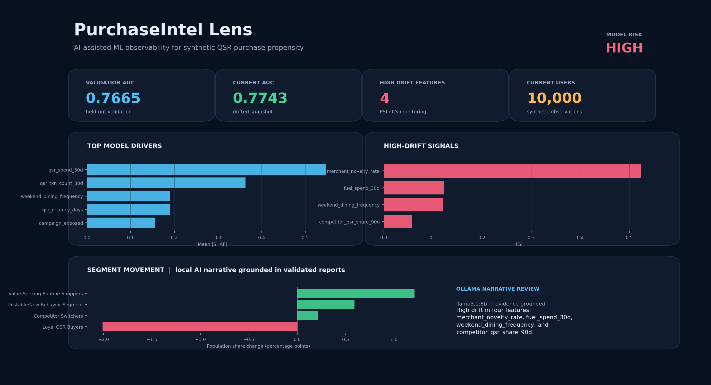
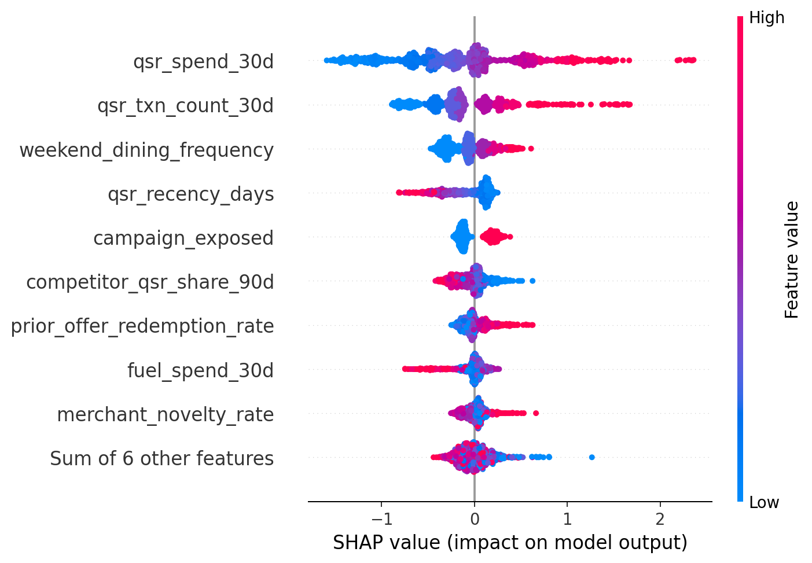
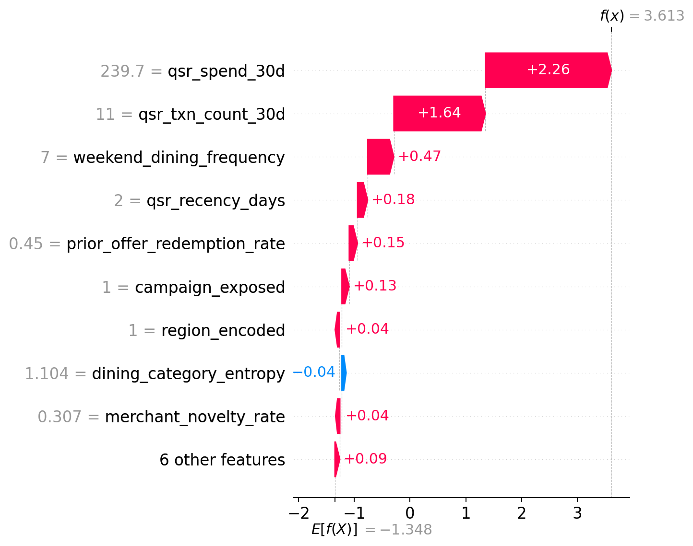
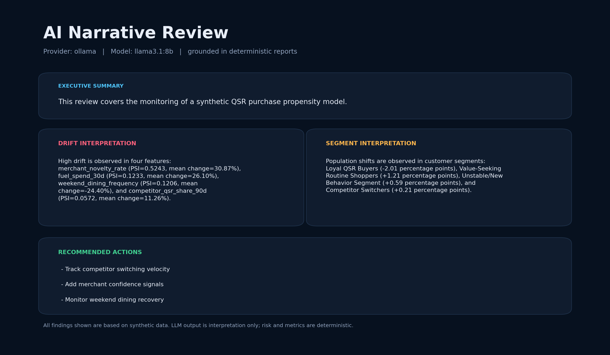
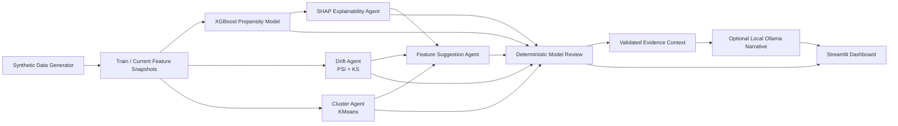

<div align="center">

# PurchaseIntel Lens

### AI-assisted model observability for synthetic QSR purchase propensity

[](https://www.python.org/)
[](https://xgboost.readthedocs.io/)
[](https://shap.readthedocs.io/)
[](https://streamlit.io/)
[](https://ollama.com/)
[](#responsible-use)

**Detect drift. Explain model behavior. Track segment movement. Recommend new signals. Generate a grounded local-AI review.**

</div>

<p align="center">
  
</p>

> The preview above is rendered directly from this repository's generated model and monitoring artifacts, not mock data or AI-generated artwork.

## What It Does

PurchaseIntel Lens is an end-to-end ML observability demo for a synthetic quick-service restaurant (QSR) purchase model. It generates controlled behavior change, trains a propensity classifier, diagnoses what shifted, explains what drives predictions, identifies segment movement, and surfaces actions in a dashboard.

The system deliberately separates **verified analytics** from **LLM interpretation**:

- Metrics, SHAP values, drift tests, clusters, feature recommendations, and risk levels are deterministic.
- A local Ollama model optionally converts those verified findings into a stakeholder-friendly narrative.
- The LLM never receives raw customer rows and never calculates or overrides monitoring results.

## Demonstrated Results

The checked-in demo run uses two synthetic snapshots of **10,000 users** each and **15 behavioral features**.

| Signal | Current Demo Result |
| --- | ---: |
| Validation AUC | `0.7665` |
| Current-period AUC | `0.7743` |
| Model risk level | **High** |
| High-drift features detected | `4` |
| Customer segments monitored | `4` |
| High-priority feature recommendations | `5` |
| Local narrative model | `ollama / llama3.1:8b` |

The risk level is **High** because multiple important feature distributions changed materially, even though AUC remained stable.

### High-Drift Findings

| Feature | PSI | Mean Change | Interpretation |
| --- | ---: | ---: | --- |
| `merchant_novelty_rate` | `0.5243` | `+30.87%` | New merchant behavior increased materially |
| `fuel_spend_30d` | `0.1233` | `+26.10%` | Essential-spend pattern shifted upward |
| `weekend_dining_frequency` | `0.1206` | `-24.40%` | Weekend dining activity declined |
| `competitor_qsr_share_90d` | `0.0572` | `+11.26%` | Competitive QSR engagement increased |

## Visual Proof

### Explainability

<p align="center">
  
  
</p>

The model is chiefly driven by `qsr_spend_30d`, `qsr_txn_count_30d`, `weekend_dining_frequency`, and `qsr_recency_days`. The waterfall view gives a local explanation for a high-propensity prediction.

### Grounded Local-AI Narrative

<p align="center">
  
</p>

The AI narrative layer is generated locally using `llama3.1:8b` through Ollama. Its output is schema-validated and rejected if it contradicts AUC direction, omits required drift evidence, or introduces unsupported claims.

## Core Capabilities

| Capability | Implementation | Output |
| --- | --- | --- |
| Synthetic behavior simulation | Seeded `pandas` / `numpy` generator with intentional current-period drift | `data/train_features.csv`, `data/current_features.csv` |
| Propensity modeling | `XGBClassifier` trained on 15 numeric features | `models/qsr_xgb_model.joblib` |
| Performance monitoring | AUC, accuracy, precision, recall, F1 | `models/model_metadata.json` |
| Explainability | SHAP global importance, beeswarm, dependence, waterfall | `reports/shap_*`, `reports/shap_plots/` |
| Drift detection | PSI plus Kolmogorov-Smirnov tests | `reports/drift_report.csv` |
| Behavioral segmentation | `StandardScaler` plus `KMeans` | `reports/*cluster*.csv` |
| Feature recommendations | Evidence-linked deterministic rules | `reports/feature_suggestions.csv` |
| Model health review | Deterministic Markdown report and risk rules | `reports/model_review_report.md` |
| AI narrative review | Grounded structured output through local Ollama | `reports/llm_model_review.md` |
| Presentation layer | Streamlit dashboard with Plotly charts | `app/streamlit_app.py` |

## Architecture



For the detailed artifact graph and integration contracts, see [CODEBASE_GRAPH.md](CODEBASE_GRAPH.md).

## Dashboard Screens

The dashboard includes nine review sections:

1. Project Overview
2. Model Health Summary
3. Model Performance Metrics
4. Top SHAP Feature Drivers
5. Drift Report Table
6. Cluster Shift Report
7. Feature Suggestions
8. Deterministic Model Review Report
9. Optional AI Narrative Review

A screen-by-screen presentation flow is available in [DEMO_RUNBOOK.md](DEMO_RUNBOOK.md).

## Quick Start

### 1. Install

Use Python 3.10 or newer.

```bash
git clone https://github.com/adsha05/PurchaseIntel-Lens.git
cd PurchaseIntel-Lens
python -m venv .venv
source .venv/bin/activate
python -m pip install -r requirements.txt
```

On macOS, XGBoost may also require:

```bash
brew install libomp
```

### 2. Run The Deterministic Analytics Pipeline

```bash
python src/generate_synthetic_data.py
python src/train_model.py
python src/agents/drift_agent.py
python src/agents/explainability_agent.py
python src/agents/cluster_agent.py
python src/agents/feature_suggestion_agent.py
python src/agents/report_agent.py
python src/validate_integration.py
```

### 3. Generate The Optional Local-AI Review

```bash
cp .env.example .env
ollama serve
ollama pull llama3.1:8b
python src/agents/llm_context_builder.py
python src/agents/narrative_agent.py
python src/validate_integration.py
```

The LLM receives only an aggregated evidence payload from validated reports:

```text
reports/llm_evidence_context.json
```

### 4. Launch The Dashboard

```bash
streamlit run app/streamlit_app.py
```

Open `http://localhost:8501`.

## Output Artifacts

```text
data/
  train_features.csv
  current_features.csv
  train_predictions.csv
  current_predictions.csv
models/
  qsr_xgb_model.joblib
  model_metadata.json
reports/
  drift_report.csv
  shap_global_importance.csv
  shap_plots/
  reference_cluster_profile.csv
  current_cluster_profile.csv
  cluster_shift_report.csv
  feature_suggestions.csv
  model_review_report.md
  llm_evidence_context.json
  llm_model_review.json
  llm_model_review.md
```

## Repository Layout

```text
app/
  streamlit_app.py                 # interactive dashboard
src/
  generate_synthetic_data.py       # synthetic snapshot generation
  train_model.py                   # XGBoost training and evaluation
  validate_integration.py          # end-to-end artifact validation
  agents/
    drift_agent.py                 # PSI and KS drift checks
    explainability_agent.py        # SHAP analysis and plots
    cluster_agent.py               # segment assignment and movement
    feature_suggestion_agent.py    # deterministic feature proposals
    report_agent.py                # auditable baseline report
    llm_context_builder.py         # grounded LLM evidence context
    narrative_agent.py             # optional local-AI review
  llm/
    schemas.py                     # structured narrative contract
    ollama_provider.py             # local model adapter
scripts/
  render_readme_assets.py         # reproducible preview images
```

## Trust Boundary

| Deterministic Source Of Truth | Optional AI Interpretation |
| --- | --- |
| XGBoost metrics | Executive narrative |
| SHAP contributions | Summary phrasing |
| PSI / KS drift tests | Follow-up questions |
| KMeans cluster movement | Stakeholder-ready explanation |
| Risk classification rules | Suggested investigation framing |

The LLM cannot change the calculated risk level or monitoring metrics. The checked-in deterministic report remains the audit baseline: [reports/model_review_report.md](reports/model_review_report.md).

## Validation

Run:

```bash
python src/validate_integration.py
```

The validator confirms:

- Feature and prediction contracts match the trained model.
- Drift and SHAP reports cover every feature.
- Cluster populations reconcile.
- Feature suggestions follow their schema.
- The deterministic report agrees with risk evidence.
- Optional Ollama narrative output is structured, attributed, and grounded.

## Responsible Use

This project uses **synthetic data only**. It is an observability and agent-workflow demonstration, not a production decision system and not a model trained on real consumer or financial records.

## Related Documentation

- [CODEBASE_GRAPH.md](CODEBASE_GRAPH.md): full dependency graph and integration contracts
- [DEMO_RUNBOOK.md](DEMO_RUNBOOK.md): local presentation flow
- [MODEL_RESULTS.md](MODEL_RESULTS.md): current model result summary
- [reports/model_review_report.md](reports/model_review_report.md): deterministic health review
- [reports/llm_model_review.md](reports/llm_model_review.md): grounded local-AI interpretation
