# AxionAI Architecture

AxionAI is a file-backed, deterministic multi-agent model-intelligence MVP for data science model review. It reviews model artifacts locally and saves auditable outputs at every stage.

## Core Workflow

```mermaid
flowchart LR
    INPUT["Feature tables<br/>Predictions<br/>Labels<br/>Metadata"] --> VALIDATE["Artifact validation"]
    VALIDATE --> MITRA["Agent 01: Mitra<br/>Signal monitoring"]
    MITRA --> VARUNA["Agent 02: Varuna<br/>Model diagnostics"]
    VARUNA --> EVIDENCE["Evidence Store<br/>Verified JSON packet"]
    EVIDENCE --> VISH["Agent 05: Vishwakarma<br/>Visual intelligence"]
    VISH --> REFRESH["Evidence refresh<br/>Matching-run visuals"]
    REFRESH --> ARYAMAN["Agent 03: Aryaman<br/>Executive synthesis"]
    ARYAMAN --> DASH["Streamlit dashboard<br/>Stakeholder review"]
    DASH --> SAM["Agent 04: Samanvaya<br/>Feedback calibration"]
    SAM --> CONFIG["Config recommendation<br/>Pending human approval"]
    REFRESH --> ARCHIVE["Timestamped run archive"]
    ARYAMAN --> ARCHIVE
    SAM --> ARCHIVE
```



## Design Principles

### Data Science First

The workflow is built around the questions a data scientist has to answer before trusting or presenting a model: did the population move, do important features drift, is the score useful, is it calibrated, which cohorts are weak, and which findings are strong enough to show stakeholders?

### Deterministic Metrics

Python calculates all monitoring and model-diagnostic values. The optional LLM boundary is narrative-only.

### Artifact Contracts

Agents exchange saved JSON and CSV artifacts rather than hidden conversational state. The workflow is easy to inspect, rerun, and archive.

### Evidence Gate

Aryaman reads `reports/evidence_packet.json`, not raw feature tables. This limits the executive report to verified findings.

### Governed Feedback

Samanvaya reads structured dashboard feedback and creates a pending `calibration_config_v2_recommended.json`. It does not change active runtime thresholds.

## Agent Contracts

| Producer | Consumer | Contract |
| --- | --- | --- |
| Artifact generator or external drop | Validator, Mitra, Varuna | Train/current features, predictions, model metadata, feature metadata |
| Mitra | Varuna, Evidence Store, dashboard | Data quality, drift, prediction movement, cluster movement |
| Varuna | Evidence Store, dashboard | SHAP, VIF, overfitting delta, calibration, lift, score deciles, segment performance, feature-risk matrix, reliability status |
| Evidence Store | Vishwakarma, Aryaman | Single verified evidence packet |
| Vishwakarma | Evidence Store refresh, dashboard | Same-run visual manifest, interactive charts, lineage SVG |
| Aryaman | Dashboard, stakeholders | Executive Markdown and JSON model-health brief |
| Dashboard feedback | Samanvaya | Structured feedback events |
| Samanvaya | Human reviewer | Pending config proposal and audit log |

## Framework Choice

The MVP uses a custom sequential Python orchestrator: `src/run_axionai_pipeline.py`.

It does not currently use LangGraph, CrewAI, AutoGen, or another agent framework. That is deliberate: the current workflow is linear, deterministic, local, and artifact-driven. A framework can be introduced later if conditional routing, distributed execution, or human-approval state machines become complex enough to justify it.

## Key Paths

```text
src/run_axionai_pipeline.py
src/agents/
src/diagnostics/
src/graph/
src/memory/
src/reports/
src/utils/
data/
models/
reports/
reports/visuals/
configs/
app/
```

For a deeper file-level graph, see [`../CODEBASE_GRAPH.md`](../CODEBASE_GRAPH.md).
